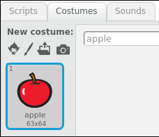
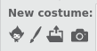
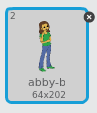

- With your sprite selected, click on the **Costumes** tab

	
	
- Select where you want to choose a costume from. From left to write your choices are:
  1. Choose costume from library
  1. Paint new costume
  1. Upload costume from file
  1. New costume from camera
  
  
  
- If you wish to delete the imported costume, select it an click on the small cross in the top right hand corner

	
